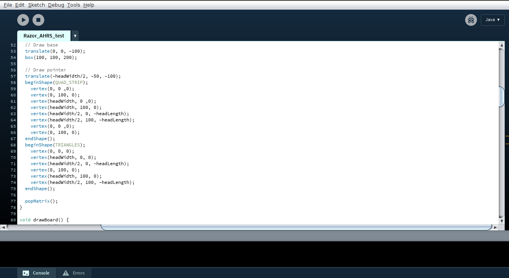
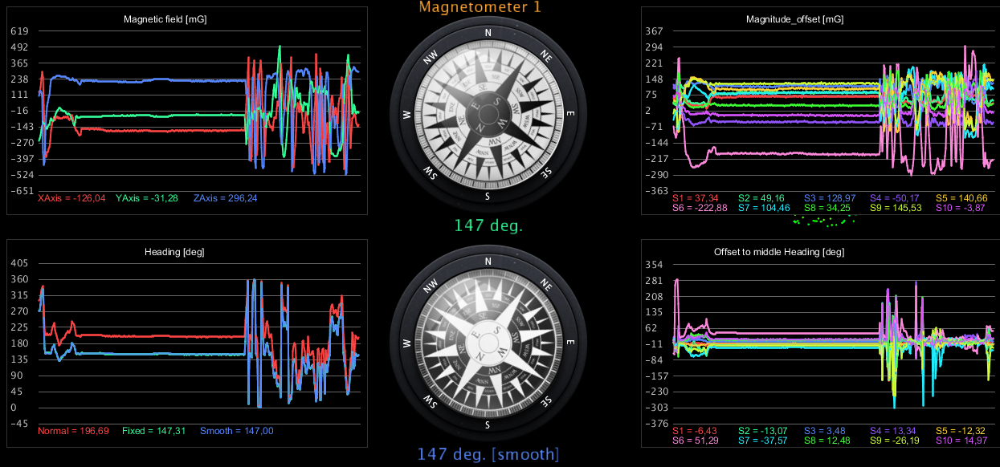
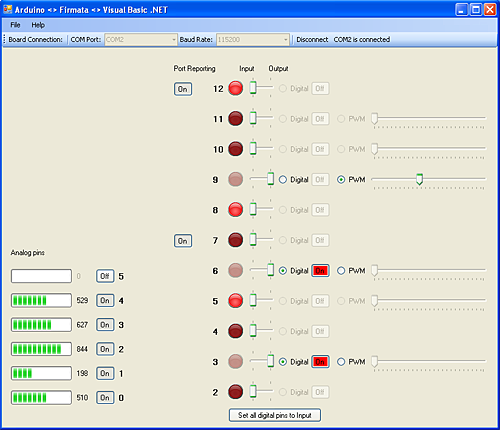
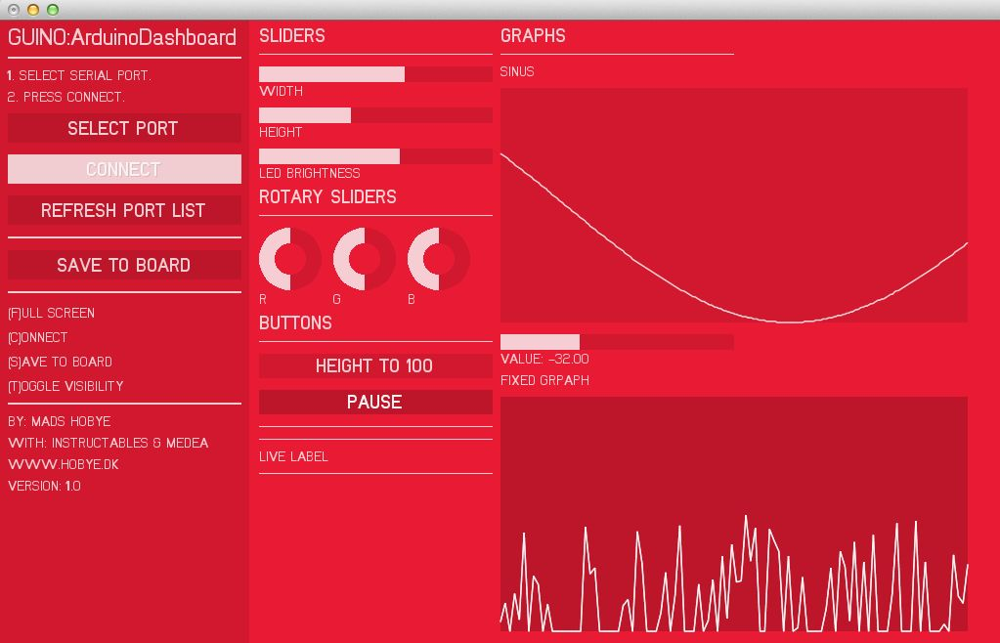
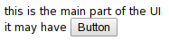
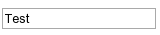
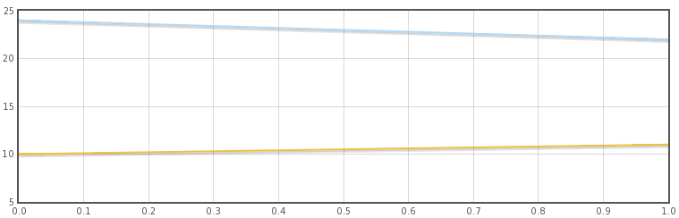

# Goal

- develop a simple framework to create control and visualsation applications for
Arduino based Devices

# Alternatives

- Processing
- Firmata
- Instrumentino
- Guino
- Arduviz and Appbuilder

## Processing

<ul>
<li> Java based programming language for visual applications
<li> GUI: a second program
<li> base for Arduino IDE
<li> well know to the Arduino community
</ul>

Screenshot of Processing IDE and Application

## Firmata

<ul>
<li>protocol based on the midi message format
<li>many inplementations: Processing, Python, Perl, Ruby, JavaScript, Java and many more
<li>huge set of functions
<li>expandable
<li>PC controls the Arduino
</ul>

[acraigie.com](http://www.acraigie.com/programming/firmatavb/sample_applications.html)

## Instrumentino

<ul>
<li>GUI for Arduino based experimental instruments
<li>uses Python
<li>description file on the PC describes the Components
<li>Arduino controls the Sensor and Actors
<li>PC controls the experiment
</ul>

[chemie.unibas.ch](http://www.chemie.unibas.ch/~hauser/open-source-lab/instrumentino/index.html)

## Guino

<ul>
<li>GUI interpreter running on the PC interpretes GUI commands send from an Arduino
<li>uses openframeworks
<li>provides functions for Arduino sketch to create the GUI
<li>provides subset of openframeworks' GUI elements
</ul>

[instructables.com](http://www.instructables.com/id/Guino-Dashboard-for-your-Arduino/)

## Arduviz and Appbuilder

- GUI interpreter running on the PC interpretes GUI commands from an Arduino
- uses python and Kivy
- provides subset of Kivy's widgets

## Gaps & Design Decisions

- second program implements the GUI

~~~
    - need to keep programs in sync
    - specific gui application might be unavailibel

    (Processing or basicaly every other programming language)
~~~

- PC is in charge of the application and the Arduino is just an interface to sensors and actors

~~~
    - might turn the programming model from the Arduino to the PC
    - PC is need since it is in charge

    (Firmata, Instrumentino)
~~~

- flexibility of the interpreters is restricted to a subset of a much bigger framework

~~~
    - changes to the gui elements are not possible

    (Guino, Arduviz)
~~~

# Arduinoview
Features:
- functions for frameing and unframeing in Arduino (ino, C) and Javascript
- Chromium-App that connects to a Arduino and contains space for a GUI
- HTML & CSS interpreter access
- JavaScript interpreter access
- runner concept for flexible GUI Applications
- Shorthand for smaller simple GUIs

## Arduinoview in Layers

## The Arduinoview Frame

Why a Frame :

    - a message is more than one symbol, but UART interface
      provides only symbols size (5-9 Bit) frames
    - when does a message start an when does it end?

Alterntives:

    - linebreak terminated
    - control bytes + message bytes (e.g.: midi message)
    - counting protocols
    - byte- or character-stuffing

## The Arduinoview Frame

    - character-stuffing
    - start- and end-marks
    - escaping to avoid reduction of the symbol set

    - each frame a determined object of communication

~~~ Definition
<Frame>     : <SOF><DATA><EOF>
<SOF>       : 0x01
<EOF>       : 0x04
<ESC>       : 0x10
<ESCMASK>   : 0x40
<DATA>      : <SYMBOL>
<DATA>      : <SYMBOL><DATA>
<SYMBOL>    : <DATAOCTET>
<SYMBOL>    : <ESC><DATAOCTET> // <DATAOCTET> <= <ESCMASK> xor Messagebyte
<DATAOCTET> : 0x00 - 0xff but {<SOF>,<EOF>,<ESC>}
~~~

## The Runner Concept

- each frame is a message
- message interpretation need
- a two character ID selects the interpreter
- interpreter function reads the string
- default runners start with "!"

~~~ Definition
<Message>   : <ID><DATA>
<ID>        : <BYTE><BYTE>
<DATA>      : <BYTES>
~~~

- add or change custom runner in Arduinoview
~~~
runner['<ID>'] = fn(x)
~~~

## Talking HTML

- HTML as description language
- CSS for styling
- workelement for structuring
- runners for appending & replacing HTML & changing the Workelement

~~~ Definition
<HTMLreplace Frame> : !h<HTML Code>
<HTMLappend Frame>  : !H<HTML Code>
<Workelement Frame> : !w<workelement> by id,IDs[] or
                      nothing to select the body-element
~~~

    "!h the UI  it may have a<input type=\'button\'
    value=\'Button\' onclick=\'sendframe(\"cc\")\'>"

## Talking JavaScript

- JavaScript
- DOM access to HTML and CSS

~~~
<JavaScript Frame> : !j<JavaScript Code>
~~~

~~~
"!jalert('ALERT')"
~~~

~~~
    HTMLreplace(x)
: replaces the innerHTML of the current workelement

    HTMLappend(x)
: creates an temporary div replaces its innerHTML and
  than appends every node inside that div to the current workelement

    sendframe(msg)
: sends a message to the Arduino using the hosts connection
  sendframe instructs the host to pack a frame

    sendraw(msg)
: sends a message to the Arduino using the hosts connection
  sendraw instructs the host to not pack a frame
  the message-string will be send byte by byte

    alert = function ERROR(msg)
: displays a red div to show errors and alerts

    loadjsfile(filename, onload)
: loads javascript-files by adding a script element to the head; see autoloader

    autoloader(filename,onload)
: this serializes the loading of multiple js files to avoid race-condition

    loadcssfile(filename)
: loads css-files by adding a style element to the head

    beep()
: sounds a beep

    receiveMessage(event)
: recives the messages from the host window runs the matching runner

    object: runner[]
: associative array that maps runner id to the matching function

    runner['!!']
: reload/resets sandbox

    runner.append(obj)
: appends an object / dictionary to the runner list

~~~

## The Shorthand

~~~
<Shorthand Frame>   : !S<Element><ID><DATA>
<Element>           : <Character>
<ID>                : <Character><Character>
<Data>              : <C><Characters>!<Data>
<Data>              : <C><Characters>
~~~

~~~
| Element | Description                                                        |
|---|--------------------------------------------------------------------------|
| l | adds a line break                                                        |
| b | adds a Button <DATA> value will be interpretet as Caption;
      onclick it will send g  its 2 byte ID                                    |
| s | adds a slider (range);
      onchange it will send !g + its 2 byte ID + it value (0-255)              |
| c | adds a checkbox;
      onchange it will send !g + its 2 byte ID + its value (t or f)            |
| M | adds a moving graph using the flot.js library                            |
| G | adds a not moving graph using the flot.js library                        |
| t | adds a textinput; onchange it will send !g + its 2 byte ID + its value   |
| d | adds a div block that is styled as a inline block                        |
~~~

    <Data>

~~~
| C | Interpretation                                                           |
|---|--------------------------------------------------------------------------|
| s | css style the element                                                    |
| w | css width                                                                |
| h | css height                                                               |
| v | value (interpretation depends on the Element)                            |
~~~

|Frame       |Result                                  |
|------------|----------------------------------------------|
|"!SbbtvTest"|         |
|"!SttxvTest"|        |
|"!Ssrt"     |         |
|"!Scck"     |       |
|"!SGgh"     |     |

# The Arduino library

- provides several possibilities to communicate to the PC-App
- kept simple easy to read for beginners in C and C++

## The Frameiterator.h

- StringtoFrame: transforms several types of Strings to a Frame
- very low memory requirements
- iterates over the input String itself
- constructors and matching addString functions

~~~
    #define StrInt( Str )
: helps casting a strings content to a uint16_t

    addString / StringtoFrame(const char* str)
: will convert a regular zero terminated C string

    addString / StringtoFrame(PGM_P str_p, char* mark)
: will convert a Program Memory String,
  mark will be ignored it just selects the right function.

    addString / StringtoFrame(const char* str, size_t length)
: will convert a byte array of the specified length

    addString / StringtoFrame(const uint16_t val, size_t  length )
: will convert up to two bytes

    char next()
: gets the next byte that should transferred

    bool done()
: returns true if the current part of the frame is complete

    bool end()
: returns true if the current (last) part of the frame is
  complete and tells StringtoFrame to end the frame

    begin()
: resets the Frameitrator for a new frame
~~~

~~~{.c}
StringtoFrame I = StringtoFrame("!Htest");
while(!I.end())Serial.write(I.next());
~~~

Note: transfers a frame containing "!Htest" (append test to the innerHTML of the
current workelement)

Framereader:
- byte by byte input
- decodes it to message
- higher memory requirements depending on its buffer

~~~
    size_t put(char c)
: puts c into the framereaders which will parsed as required by the frameing protocol
  returns the current number of byte in the buffer or 0 if the frame is
  larger than Framereaders buffer or the frame is complete but not yet cleared.

    size_t length()
: returns 0 until there is a complete message buffer
  else it returns the size of the message in buffer.

    char * frame()
: returns 0 until there is a complete message buffer
  else it returns a pointer to the message.

    void clearframe()
: clears the current frame makes Framereader availible to receive a new message
~~~

~~~{.c}
static Framereader frm_in;
while(Serial.available()){
    frm_in.put(Serial.read());
    if(frm_in.length() != 0){
            //interpret frame (frm_in.frame(),frm_in.length());
        frm_in.clearframe();
    }
}
~~~
Note: declare and construct a static Framereader object check Serial interface for availible bytes, if there are bytes read them and if a frame is complete
interpret it (interpretation has to be done by the user since this is the frameing layer)

## FrameStream.h

- got split into FramePrint and FrameRun
- FramePrint implements the Print interface of Arduino
- FrameRun implements the run() function
- FrameStream does both

~~~
    FrameStream(Stream &serial)
: constructs a FrameStream using that will use the specified Stream (serial interface)

    size_t write(uint8_t c)
: write c to the Frame;
  Frame will be automatically started

    size_t write(const uint8_t *buffer, size_t size)
: writes size bytes from the buffer to the Frame;
  Frame will be automatically started

    end()
: ends the current frame

    bool run()
: reads a byte from the Stream;
  starts the interpretation of the frame if it is complete. interpretation is done by the eventlist(Framereader&).

Print class defines print( ) functions for

    (char *)
    (String &)
    (int), (unsingend int)
    (char), (usingend char),
    (double),
    (_FlashStringHelper)

that are documented at "https://www.arduino.cc/en/Reference/Serial" print() is availible
~~~

## Runnerlist

- preprocessor macros create runnerlist(char * str, size_t size) function
- runners are ifs for that call a function
- fwdrunners call the function stepping over the ID

~~~
    #define beginrunnerlist(NAME)
:starts a runnerlist, the is put in front of
 runnerlist(char* str , size_t length)
 FrameStream::run runs Runnerlist with empty NAME.

    #define runner(ID,runner_function)
:adds a runner if statement to the runnerlist function
 that will run runner_function(char * str, size_t size) if triggered
 str and size are the same as put into this runnerlist

    #define fwdrunner(ID,runner_function)
:adds a fwdrunner if statement to the runnerlist function
 that will run runner_function(char * str, size_t size) if triggered
 str and size step over the ID of the current inputs

    #define endrunnerlist()
ends the runnerlist function
~~~
Example:

~~~{.c}
beginrunnerlist();
runner(!!,gui_init);
runner(BB,test);
endrunnerlist();
~~~

Note: creates a runnerlist function that will call gui_init(char*, size_t) if "!!" is at the head of the frame and test(char*, size_t) if "BB" is at the head of the
frame.

## TODO

- a "website plus serial server" version where the server provides the serial interface access
- a electron app version
- select further libraries to include in the app
- expand Arduinuview-Shorthand
    - more charts (bar, pie)
    - predefined styles
    - keypress
- add functions to the Arduino library that map to Arduinoview Shorthand (easy access)
- more examples cheat sheet

# ? ? ?
# ? ? ?
# ? ? ?

# extra examples

### StringtoFrame
~~~{.c}
// in global context requirement by the pgmspace.h library
const char test_p[] PROGMEM = "!H"
"<h1> Heading ";

// in a function
StringtoFrame I = StringtoFrame(tesp_p,"");
while(!I.done())Serial.write(I.next());

// some thing that generates char * cstr

StringtoFrame I = StringtoFrame(cstr);
while(!I.done())Serial.write(I.next());

StringtoFrame I = StringtoFrame("</h1>");
while(!I.end())Serial.write(I.next());

transfers a frame containing "!H<h1> Heading " + cstr + "</h1>"
(append a heading to the innerHTML of the current workelement)
~~~

### FrameStream

~~~{.c}
// global
FrameStream frm(Serial);

//in setup function
const __FlashStringHelper * startpage = F("!h<h1 onclick=sendframe('!bc')>
                                            Click Me</h1>");
frm.print(startpage);
frm.end();

//in loop
frm.run();

initializes a FrameStream transfer startpage with a Click Me Heading to the PC.
~~~

~~~{.c}
void alert( char * str){
    frm.print(F("!jalert(\""));
    frm.print(str);
    frm.print(F("\");"));
    frm.end();
}

calls JavaScript's alert() function
~~~
